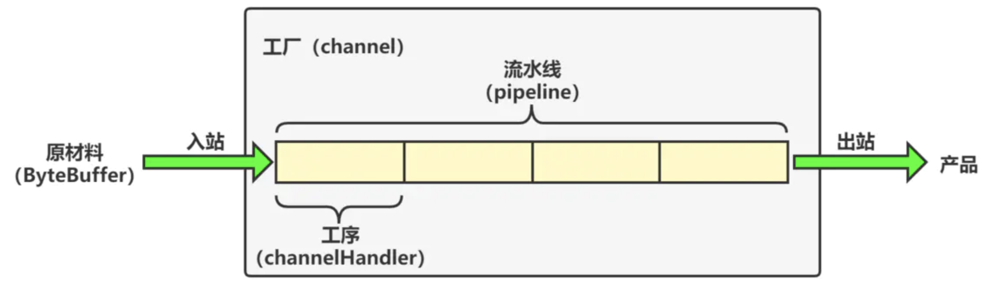
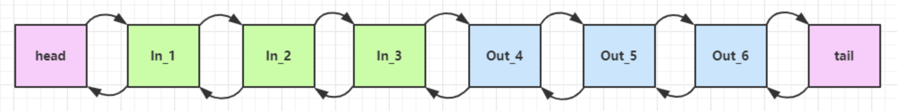
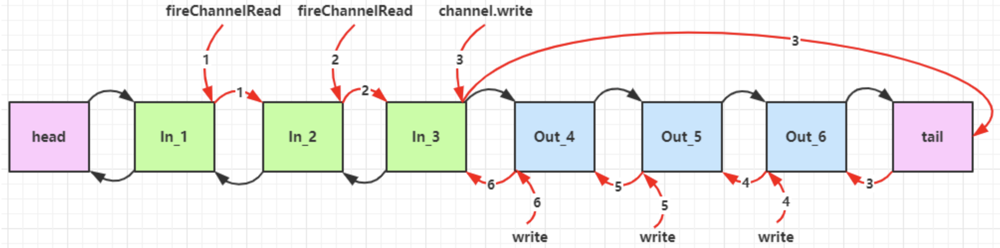

# 一.概述

ChannelHandler 用来处理 Channel 上的各种事件，分为入站、出站两种。

所有 ChannelHandler 被连成一串，就是 Pipeline

- 入站处理器通常是 `ChannelInboundHandlerAdapter` 的子类，主要用来读取客户端数据，写回结果；
- 出站处理器通常是 `ChannelOutboundHandlerAdapter` 的子类，主要对写回结果进行加工。

**示例：**

<div align="center">  
    
  </div>

在这里，每个 Channel 是一个产品的加工车间，Pipeline 是车间中的流水线，ChannelHandler 就是流水线上的各道工序，而后面要讲的 ByteBuf 是原材料，经过很多工序的加工：先经过一道道入站工序，再经过一道道出站工序最终变成产品。

# 二. 示例分析

**服务器端代码：**

```java
public class Server {
    public static void main(String[] args) {
        new ServerBootstrap()
                .group(new NioEventLoopGroup())
                .channel(NioServerSocketChannel.class)
                .childHandler(new ChannelInitializer<NioSocketChannel>() {
                    @Override
                    protected void initChannel(NioSocketChannel ch) {
                        //通过channel拿到pipeline
                        ChannelPipeline pipeline = ch.pipeline();
                        //添加处理器 head ->  h1 -> h2 ->  h3 -> h4 -> h5 -> h6 -> tail
                        pipeline.addLast("h1",new ChannelInboundHandlerAdapter(){
                            @Override
                            public void channelRead(ChannelHandlerContext ctx, Object msg) {
                                System.out.println(1);
                                ctx.fireChannelRead(msg); // 1
                            }
                        });
                        pipeline.addLast("h2",new ChannelInboundHandlerAdapter(){
                            @Override
                            public void channelRead(ChannelHandlerContext ctx, Object msg) {
                                System.out.println(2);
                                // 将数据传递给下个 handler，如果不调用，调用链会断开或者调用
                                ctx.fireChannelRead(msg); // 2
                            }
                        });
                        pipeline.addLast("h3",new ChannelInboundHandlerAdapter(){
                            @Override
                            public void channelRead(ChannelHandlerContext ctx, Object msg) {
                                System.out.println(3);
                                // 必须要往客户端回写数据 出站的handler才会触发执行
                     //ch.writeAndFlush(ctx.alloc().buffer().writeBytes("server...".getBytes()));
                                ctx.channel().write(msg); // 3
                            }
                        });
                        // 再添加几个出站的Handler
                        pipeline.addLast("h4",new ChannelOutboundHandlerAdapter(){
                            @Override
                            public void write(ChannelHandlerContext ctx, Object msg,
                                              ChannelPromise promise) {
                                System.out.println(4);
                                ctx.write(msg, promise); // 4
                            }
                        });
                        pipeline.addLast("h5",new ChannelOutboundHandlerAdapter(){
                            @Override
                            public void write(ChannelHandlerContext ctx, Object msg,
                                              ChannelPromise promise) {
                                System.out.println(5);
                                ctx.write(msg, promise); // 5
                            }
                        });
                        pipeline.addLast("h6",new ChannelOutboundHandlerAdapter(){
                            @Override
                            public void write(ChannelHandlerContext ctx, Object msg,
                                              ChannelPromise promise) {
                                System.out.println(6);
                                ctx.write(msg, promise); // 6
                            }
                        });
                    }
                })
                .bind(8080);
    }
}
```

客户端代码：

```java
public class Client {
    public static void main(String[] args) {
        new Bootstrap()
                .group(new NioEventLoopGroup())
                .channel(NioSocketChannel.class)
                .handler(new ChannelInitializer<Channel>() {
                    @Override
                    protected void initChannel(Channel ch) {
                        ch.pipeline().addLast(new StringEncoder());
                    }
                })
                .connect("127.0.0.1", 8080)
                .addListener((ChannelFutureListener) future -> {
                    future.channel().writeAndFlush("hello,world");
                });
        System.out.println();
    }
}
```

运行结果：

```luna
1
2
3
6
5
4
```

从输出结果可以看出

- ChannelInboundHandlerAdapter 是按照 addLast 的顺序执行的
- ChannelOutboundHandlerAdapter 是按照 addLast 的逆序执行的

ChannelPipeline 的实现是一个 ChannelHandlerContext（包装了 ChannelHandler） 组成的双向链表

<div align="center">  
    
  </div>

- 入站处理器中，`ctx.fireChannelRead(msg)` 是 **调用下一个入站处理器**
  - 如果注释掉 1 处代码，则仅会打印 1
  - 如果注释掉 2 处代码，则仅会打印 1 2
- 3 处的 `ctx.channel().write(msg)` 会 **从尾部开始触发** 后续出站处理器的执行
  - 如果注释掉 3 处代码，则仅会打印 1 2 3
- 类似的，出站处理器中，``ctx.write(msg, promise)` 的调用也会 **触发上一个出站处理器**
  - 如果注释掉 6 处代码，则仅会打印 1 2 3 6

- **`ctx.channel().write(msg)`** vs **`ctx.write(msg)`**
  - 都是触发出站处理器的执行
  - `ctx.channel().write(msg)` 从 **尾部** 开始查找出站处理器
  - `ctx.write(msg)` 是从 **当前节点** 找上一个出站处理器
  - 3 处的 `ctx.channel().write(msg)` 如果改为 `ctx.write(msg)` 仅会打印 1 2 3，因为节点 3 之前没有其它出站处理器了
  - 6 处的 `ctx.write(msg, promise)` 如果改为 `ctx.channel().write(msg)` 会打印 1 2 3 6 6 6… 因为 `ctx.channel().write()` 是从尾部开始查找，结果又是节点 6 自己

服务端 pipeline 触发的原始流程，下图中数字代表了处理步骤的先后次序

<div align="center">  
    
  </div>
