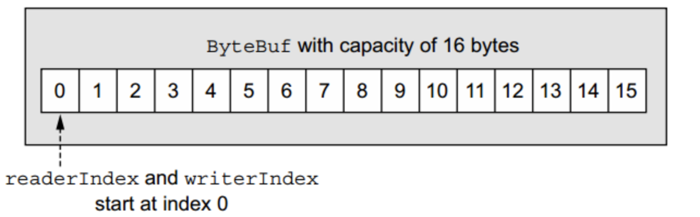
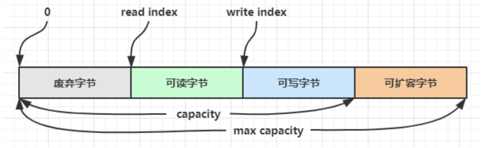
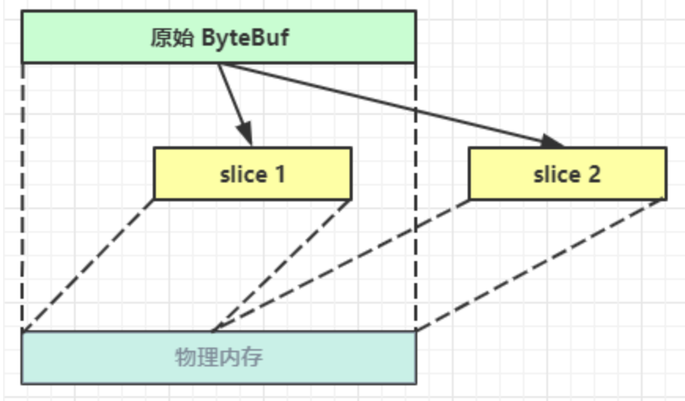
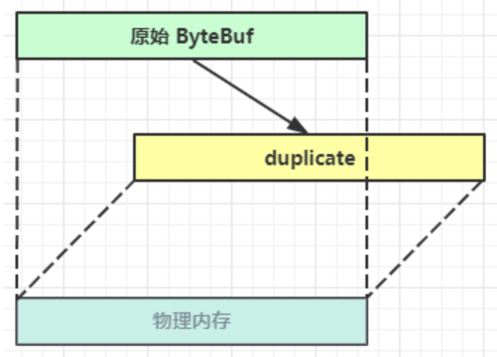

# 一.概述

ByteBuf 是对 NIO 中 ByteBuffer 的增强。相比于 ByteBuffer ，Netty 的 ByteBuf 具有卓越的功能性和灵活性。

**ByteBuf API 的优点：**

- 可以被用户自定义的缓冲区类型扩展
- 通过内置的复合缓冲区类型实现透明的零拷贝
- 容量可以按需增长
- 在读和写这两种模式之间切换不需要调用 ByteBuffer 的 `flip()` 方法
- 在读和写使用了不同的索引
- 支持方法的链式调用
- 支持引用计数
- 支持池化

# 二. 工作原理

ByteBuf 维护了两个不同的索引：一个用于读取，一个用于写入，当从 ByteBuf 读取时，readIndex 会递增已经被读取的字节数。同样的，当写入 ByteBuf 时，它的 writeIndex 也会递增。

<div align="center">  
    
  </div>

readIndex 和 writeIndex 的起始位置都为 0。

如果 readIndex 和 writeIndex 的值相等，也即此时已经到了可读取数据的末尾，就如同达到数组末尾一样，试图读取超出该点的数据将触发 IndexOutOfBoundsException。

- 名称以 read 或者 write 开头的 ByteBuf 方法，将会推进其对应的索引
- 名称以 set 或者 get 开关的操作则不会。

可以指定ByteBuf的最大容量。（默认的限制是Integer.MAX_VALUE）。

#  三. ByteBuf 的创建

可以通过 ByteBuf Allocator 类中的默认实现来创建一个 Bytebuf，在创建时可以指定容量大小，不指定则默认为256

```java
public class ByteBufCreateDemo {
    public static void main(String[] args) {
        //在传参时可以指定ByteBuf的容量,如果不指定的默认是256
				//ByteBuf buffer = ByteBufAllocator.DEFAULT.buffer(10);
        ByteBuf buffer = ByteBufAllocator.DEFAULT.buffer();
    }
}
```

相比于NIO中的ByteBuffer，Netty中的Bytebuf可以动态扩容。

```java
public class ByteBufTest {
    public static void main(String[] args) {
        // 创建一个Bytebuf，默认创建的容量是256
        ByteBuf byteBuf = ByteBufAllocator.DEFAULT.buffer();
        System.out.println("添加数据前：" + byteBuf);
        // 往Bytebuf中写数据
        StringBuilder stringBuilder = new StringBuilder();
        // 故意超过初始容量，验证是否会自动扩容
        for (int i = 0; i < 300; ++i) {
            stringBuilder.append("a");
        }
        // 将数据写入ByteBuf
        byteBuf.writeBytes(stringBuilder.toString().getBytes());
        System.out.println("添加数据后：" + byteBuf);
    }
}
```

输出结果：

```lua
添加数据前：PooledUnsafeDirectByteBuf(ridx: 0, widx: 0, cap: 256)
添加数据后：PooledUnsafeDirectByteBuf(ridx: 0, widx: 300, cap: 512)
```

其中：

-  **ridx** ：表示read index，即读取位置；
-  **widx** ：表示write index，即写入位置；
-  **cap** ：表示容量

从程序运行结果可知，将数据写入 ByteBuf 后容量由之前的 256 扩容到 512 ，扩大了一倍。

# 四. ByteBuf 的使用模式

**ByteBuf共有三种模式:**

- 堆缓冲区模式(Heap Buffer)

  ```java
  //可以使用下面的代码来创建池化基于 堆 的 ByteBuf
  ByteBuf buffer = ByteBufAllocator.DEFAULT.heapBuffer(16);
  ```

- 直接缓冲区模式(Direct Buffer)

  ```java
  //通过该方法创建的ByteBuf，使用的是基于 直接内存 的 ByteBuf
  ByteBuf buffer = ByteBufAllocator.DEFAULT.directBuffer(10);
  ```

- 复合缓冲区模式(Composite Buffer)

## 1. 堆缓冲区模式(Heap Buffer)

堆缓冲区模式又称为 **支撑数组(backing array)** 。将数据存放在 JVM 的堆空间，通过将数据存储在数组中实现。

-  **优点** : 由于数据存储在JVM堆中可以快速创建和快速释放，并且提供了数组直接快速访问的方法
-  **缺点** : 每次数据与I/O进行传输时，都需要将数据拷贝到直接缓冲区

```java
public class ByteBufHeapBufferDemo {
    public static void main(String[] args) {    
        // 创建一个堆缓冲区
        ByteBuf buffer = Unpooled.buffer(10);
        String s = "waylau";
        buffer.writeBytes(s.getBytes());
        // 检查是否是支撑数组
        if (buffer.hasArray()) {
            // 获取支撑数组的引用
            byte[] array = buffer.array();
            // 计算第一个字节的偏移量
            int offset = buffer.readerIndex() + buffer.arrayOffset();
            // 可读字节数
            int length = buffer.readableBytes();
            printBuffer(array, offset, length);
        }
    }
    //打印出Buffer的信息
    private static void printBuffer(byte[] array, int offset, int len) {
        System.out.println("array：" + array);
        System.out.println("array->String：" + new String(array));
        System.out.println("offset：" + offset);
        System.out.println("len：" + len);
    }
}
```

**运行结果**

```lua
array：[B@5b37e0d2
array->String：waylau    
offset：0
len：6
```

## 2. 直接缓冲区模式(Direct Buffer)

Direct Buffer属于堆外分配的直接内存，不会占用堆的容量。适用于套接字传输过程，避免了数据从内部缓冲区拷贝到直接缓冲区的过程，性能较好。

- **优点**: 使用Socket传递数据时性能很好，避免了数据从 Jvm 堆内存拷贝到直接缓冲区的过程。提高了性能
- **缺点:** 相对于堆缓冲区而言，Direct Buffer 分配内存空间和释放更为昂贵

```java
public class ByteBufDirectBufferDemo {
    public static void main(String[] args) {
        // 创建一个直接缓冲区
        ByteBuf buffer = Unpooled.directBuffer(10);
        String s = "waylau";
        buffer.writeBytes(s.getBytes());
        // 检查是否是支撑数组.
        // 不是支撑数组，则为直接缓冲区
        if (!buffer.hasArray()) {
            // 计算第一个字节的偏移量
            int offset = buffer.readerIndex();
            // 可读字节数
            int length = buffer.readableBytes();
            // 获取字节内容
            byte[] array = new byte[length];
            buffer.getBytes(offset, array);
            printBuffer(array, offset, length);
        }
    }
    //打印出Buffer的信息
    private static void printBuffer(byte[] array, int offset, int len) {
        System.out.println("array：" + array);
        System.out.println("array->String：" + new String(array));
        System.out.println("offset：" + offset);
        System.out.println("len：" + len);
    }
}
```

**运行结果**

```lua
array：[B@6d5380c2
array->String：waylau
offset：0
len：6
```

对于涉及大量I/O的数据读写，建议使用Direct Buffer。而对于用于后端的业务消息编解码模块建议使用Heap Buffer。

## 3.  复合缓冲区模式(Composite Buffer)

Composite Buffer是 Netty 特有的缓冲区。本质上类似于提供一个或多个 ByteBuf 的组合视图，可以根据需要添加和删除不同类型的 ByteBuf 。

- **优点**：提供了一种访问方式让使用者自由地组合多个 `ByteBuf` ，避免了复制和分配新的缓冲区。
- **缺点**：不支持访问其支撑数组。因此如果要访问，需要先将内容复制到堆内存中，再进行访问。

以下示例是复合缓冲区将堆缓冲区和直接缓冲区组合在一起，没有进行任何复制过程，仅仅创建了一个视图而已。

```java
public class ByteBufCompositeBufferDemo {
    public static void main(String[] args) {
        // 创建一个堆缓冲区
        ByteBuf heapBuf = Unpooled.buffer(3);
        String way = "way";
        heapBuf.writeBytes(way.getBytes());
        // 创建一个直接缓冲区
        ByteBuf directBuf = Unpooled.directBuffer(3);
        String lau = "lau";
        directBuf.writeBytes(lau.getBytes());
        // 创建一个复合缓冲区
        CompositeByteBuf compositeBuffer = Unpooled.compositeBuffer(10);
        compositeBuffer.addComponents(heapBuf, directBuf); // 将缓冲区添加到符合缓冲区
        // 检查是否是支撑数组.
        // 不是支撑数组，则为复合缓冲区
        if (!compositeBuffer.hasArray()) {
            for (ByteBuf buffer : compositeBuffer) {
                // 计算第一个字节的偏移量
                int offset = buffer.readerIndex();
                // 可读字节数
                int length = buffer.readableBytes();
                // 获取字节内容
                byte[] array = new byte[length];
                buffer.getBytes(offset, array);
                printBuffer(array, offset, length);
            }
        }
    }
    //打印出Buffer的信息
    private static void printBuffer(byte[] array, int offset, int len) {
        System.out.println("array：" + array);
        System.out.println("array->String：" + new String(array));
        System.out.println("offset：" + offset);
        System.out.println("len：" + len);
    }
}
```

**运行结果**

```lua
array：[B@4d76f3f8
array->String：way
offset：0
len：3
array：[B@2d8e6db6
array->String：lau
offset：0
len：3
```

`CompositeByteBuf ` 是一个虚拟的缓冲区，其用途是将多个缓冲区显示为单个合并缓冲区，类似数据库中的视图。

# 五. 池化与非池化

池化的最大意义在于可以重用 ByteBuf，优点有

- 没有池化，则每次都得创建新的 ByteBuf 实例，这个操作对直接内存代价昂贵，就算是堆内存，也会增加 GC 压力
- 有了池化，则可以重用池中 ByteBuf 实例，并且采用了与 jemalloc 类似的内存分配算法提升分配效率
- 高并发时，池化功能更节约内存，减少内存溢出的可能

池化功能是否开启，可以通过下面的系统环境变量来设置

```java
-Dio.netty.allocator.type={unpooled|pooled}
```

- 4.1 以后，非 Android 平台默认启用池化实现，Android 平台启用非池化实现
- 4.1 之前，池化功能还不成熟，默认是非池化实现

# 六. ByteBuf 的组成

<div align="center">  
    
  </div>

- ByteBuf 是一个字节容器，容器里面的的数据分为四个部分

  - 第一个部分是已经丢弃的字节，这部分数据是无效的；（已经读过的内容）

  - 第二部分是可读字节，这部分数据是 ByteBuf 的主体数据， 从 ByteBuf 里面读取的数据都来自这一部分;（已经写入但还未读取的内容）

  - 第三部分数据是可写字节，所有写到 ByteBuf 的数据都会写到这一段；（剩余可写入数据的空间大小）

  - 最后一部分表示的是该 ByteBuf 最多还能扩容多少容量

- 上图中除了可扩容部分，剩下的内容是被两个指针给划分出来的，从左到右，依次是读指针（readerIndex）、写指针（writerIndex），然后还有一个变量 capacity，表示 ByteBuf 底层内存的总容量；

- 从 ByteBuf 中每读取一个字节，readerIndex 自增1，ByteBuf 里面总共有 `writerIndex-readerIndex`  个字节可读, 由此可以推论出当 readerIndex 与 writerIndex 相等的时候，ByteBuf 不可读；
- 写数据是从 writerIndex 指向的部分开始写，每写一个字节，writerIndex 自增1，直到增到 capacity，这个时候，表示 ByteBuf 已经不可写了；
- ByteBuf 里面还有一个参数 maxCapacity，当向 ByteBuf 写数据的时候，如果容量不足，那么这个时候可以进行扩容，直到 capacity 扩容到 maxCapacity，超过 maxCapacity 就会报错。

# 七. 写入/写出 API

## 1. 写入

| 方法签名                                                     | 含义                   | 备注                                        |
| ------------------------------------------------------------ | ---------------------- | ------------------------------------------- |
| writeBoolean(boolean value)                                  | 写入 boolean 值        | 用一字节 `01/00` 代表 `true/false`          |
| writeByte(int value)                                         | 写入 byte 值           |                                             |
| writeShort(int value)                                        | 写入 short 值          |                                             |
| writeInt(int value)                                          | 写入 int 值            | Big Endian，即 0x250，写入后 00 00 02 50    |
| writeIntLE(int value)                                        | 写入 int 值            | Little Endian，即 0x250，写入后 50 02 00 00 |
| writeLong(long value)                                        | 写入 long 值           |                                             |
| writeChar(int value)                                         | 写入 char 值           |                                             |
| writeFloat(float value)                                      | 写入 float 值          |                                             |
| writeDouble(double value)                                    | 写入 double 值         |                                             |
| writeBytes(ByteBuf src)                                      | 写入 netty 的 ByteBuf  |                                             |
| writeBytes(byte[] src)                                       | 写入 byte[]            |                                             |
| writeBytes(ByteBuffer src)                                   | 写入 nio 的 ByteBuffer |                                             |
| int writeCharSequence(CharSequence sequence, Charset charset) |                        |                                             |

**注意**

- 这些方法的未指明返回值的，其返回值都是 ByteBuf，意味着可以链式调用
- 网络传输，默认习惯是 Big Endian，即大端写入。

```java
public class ByteBufTest {
    public static void main(String[] args) {
        //创建ByteBuf
        ByteBuf buffer = ByteBufAllocator.DEFAULT.buffer(16,20);
        log(buffer);
        // 向buffer中写入数据
        buffer.writeBytes(new byte[]{1, 2, 3, 4});
        log(buffer);

        buffer.writeInt(5);
        log(buffer);

        buffer.writeIntLE(6);
        log(buffer);

        buffer.writeLong(7);
        log(buffer);
    }
    private static void log(ByteBuf buffer) {
        int length = buffer.readableBytes();
        int rows = length / 16 + (length % 15 == 0 ? 0 : 1) + 4;
        StringBuilder buf = new StringBuilder(rows * 80 * 2)
                .append("read index:").append(buffer.readerIndex())
                .append(" write index:").append(buffer.writerIndex())
                .append(" capacity:").append(buffer.capacity())
                .append(NEWLINE);
        appendPrettyHexDump(buf, buffer);
        System.out.println(buf.toString());
    }
}
```

运行结果:

```lua
read index:0 write index:0 capacity:16

read index:0 write index:4 capacity:16
         +-------------------------------------------------+
         |  0  1  2  3  4  5  6  7  8  9  a  b  c  d  e  f |
+--------+-------------------------------------------------+----------------+
|00000000| 01 02 03 04                                     |....            |
+--------+-------------------------------------------------+----------------+
read index:0 write index:8 capacity:16
         +-------------------------------------------------+
         |  0  1  2  3  4  5  6  7  8  9  a  b  c  d  e  f |
+--------+-------------------------------------------------+----------------+
|00000000| 01 02 03 04 00 00 00 05                         |........        |
+--------+-------------------------------------------------+----------------+
read index:0 write index:12 capacity:16
         +-------------------------------------------------+
         |  0  1  2  3  4  5  6  7  8  9  a  b  c  d  e  f |
+--------+-------------------------------------------------+----------------+
|00000000| 01 02 03 04 00 00 00 05 06 00 00 00             |............    |
+--------+-------------------------------------------------+----------------+
read index:0 write index:20 capacity:20
         +-------------------------------------------------+
         |  0  1  2  3  4  5  6  7  8  9  a  b  c  d  e  f |
+--------+-------------------------------------------------+----------------+
|00000000| 01 02 03 04 00 00 00 05 06 00 00 00 00 00 00 00 |................|
|00000010| 00 00 00 07                                     |....            |
+--------+-------------------------------------------------+----------------+
```

还有一类方法是 **set 开头** 的一系列方法，也 **可以写入数据，但不会改变写指针位置**

## 2. 读取

| 参数                      | 含义                                                     |
| ------------------------- | -------------------------------------------------------- |
| buffer.readByte()         | 每次读取一个字节                                         |
| buffer.readInt()          | 每次读取一个整数，也就是四个字节                         |
| buffer.markReaderIndex()  | 为读指针做一个标记，配合下面的方法可以实现重复读取某个数 |
| buffer.resetReaderIndex() | 将读指针跳到上一个标记过的地方实现重复读取某个数         |

除了上面一些了 read 开头的方法以外，还有一系列 get 开头的方法也可以读取数据，只不过 get 开头的方法不会改变读指针位置。相当于是按索引去获取。

**示例**

如果需要 **重复读取** ，需要调用 `buffer.markReaderIndex()` 对读指针进行标记，并通过 `buffer.resetReaderIndex()` 将读指针恢复到 mark 标记的位置

```java
public class ByteBufTest {
    public static void main(String[] args) {
        // 创建ByteBuf
        ByteBuf buffer = ByteBufAllocator.DEFAULT.buffer(16, 20);

        // 向buffer中写入数据
        buffer.writeBytes(new byte[]{1, 2, 3, 4});
        buffer.writeInt(5);
        log(buffer);
        // 读取4个字节
        System.out.println(buffer.readByte());
        System.out.println(buffer.readByte());
        System.out.println(buffer.readByte());
        System.out.println(buffer.readByte());
        log(buffer);

        // 通过mark与reset实现重复读取
        buffer.markReaderIndex();
        System.out.println(buffer.readInt());
        log(buffer);

        // 恢复到mark标记处
        buffer.resetReaderIndex();
        log(buffer);
    }
}
```

运行结果：

```lua
read index:0 write index:8 capacity:16
         +-------------------------------------------------+
         |  0  1  2  3  4  5  6  7  8  9  a  b  c  d  e  f |
+--------+-------------------------------------------------+----------------+
|00000000| 01 02 03 04 00 00 00 05                         |........        |
+--------+-------------------------------------------------+----------------+
1
2
3
4
read index:4 write index:8 capacity:16
         +-------------------------------------------------+
         |  0  1  2  3  4  5  6  7  8  9  a  b  c  d  e  f |
+--------+-------------------------------------------------+----------------+
|00000000| 00 00 00 05                                     |....            |
+--------+-------------------------------------------------+----------------+
5
read index:8 write index:8 capacity:16

read index:4 write index:8 capacity:16
         +-------------------------------------------------+
         |  0  1  2  3  4  5  6  7  8  9  a  b  c  d  e  f |
+--------+-------------------------------------------------+----------------+
|00000000| 00 00 00 05                                     |....            |
+--------+-------------------------------------------------+----------------+
```

## 3. 扩容

从上方写入数据示例根据结果可以看到，在如下的代码中产生了动态扩容操作

```java
buffer.writeLong(7);
log(buffer);
```

**运行结果**

```lua
//扩容前
read index:0 write index:12 capacity:16
         +-------------------------------------------------+
         |  0  1  2  3  4  5  6  7  8  9  a  b  c  d  e  f |
+--------+-------------------------------------------------+----------------+
|00000000| 01 02 03 04 00 00 00 05 06 00 00 00             |............    |
+--------+-------------------------------------------------+----------------+
//扩容后
read index:0 write index:20 capacity:20
         +-------------------------------------------------+
         |  0  1  2  3  4  5  6  7  8  9  a  b  c  d  e  f |
+--------+-------------------------------------------------+----------------+
|00000000| 01 02 03 04 00 00 00 05 06 00 00 00 00 00 00 00 |................|
|00000010| 00 00 00 07                                     |....            |
+--------+-------------------------------------------------+----------------+
```

**扩容规则**

- 如何写入后数据大小未超过 512，则选择下一个 16 的整数倍，例如写入后大小为 12 ，则扩容后 capacity 是 16
- 如果写入后数据大小超过 512，则选择下一个 2^n，例如写入后大小为 513，则扩容后 capacity 是 2^ 10=1024（2^9=512 已经不够了）
- 扩容不能超过 max capacity 会报错

#  八. 内存回收

## 1. 基本介绍

由于 Netty 中有堆外内存（直接内存）的 ByteBuf 实现，**堆外内存最好是手动来释放**，而不是等 GC 垃圾回收。

- UnpooledHeapByteBuf 使用的是 JVM 内存，只需等 GC 回收内存即可
- UnpooledDirectByteBuf 使用的就是直接内存了，需要特殊的方法来回收内存
- PooledByteBuf 和它的子类使用了池化机制，需要更复杂的规则来回收内存

Netty 这里采用了引用计数法来控制回收内存，每个 ByteBuf 都实现了 ReferenceCounted 接口

- 每个 ByteBuf 对象的初始计数为 1
- 调用 release 方法计数减 1，如果计数为 0，ByteBuf 内存被回收
- 调用 retain 方法计数加 1，表示调用者没用完之前，其它 handler 即使调用了 release 也不会造成回收
- 当计数为 0 时，底层内存会被回收，这时即使 ByteBuf 对象还在，其各个方法均无法正常使用

## 2. 内存回收规则

因为 pipeline 的存在，一般需要将 ByteBuf 传递给下一个 ChannelHandler，如果在每个 ChannelHandler 中都去调用 release ，就失去了传递性（如果在这个 ChannelHandler 内这个 ByteBuf 已完成了它的使命，那么便无须再传递）

基本规则是， **谁是最后使用者，谁负责 release**

- 起点，对于 NIO 实现来讲，在 io.netty.channel.nio.AbstractNioByteChannel.NioByteUnsafe#read 方法中首次创建 ByteBuf 放入 pipeline（line 163 pipeline.fireChannelRead(byteBuf)）
- 入站 ByteBuf 处理原则
  - 对原始 ByteBuf 不做处理，调用 ctx.fireChannelRead(msg) 向后传递，这时无须 release
  - **将原始 ByteBuf 转换为其它类型的 Java 对象，这时 ByteBuf 就没用了，必须 release**
  - **如果不调用 ctx.fireChannelRead(msg) 向后传递，那么也必须 release**
  - **注意各种异常，如果 ByteBuf 没有成功传递到下一个 ChannelHandler，必须 release**
  - 假设消息一直向后传，那么 TailContext 会负责释放未处理消息（原始的 ByteBuf）
- 出站 ByteBuf 处理原则
  - 出站消息最终都会转为 ByteBuf 输出，一直向前传，由 HeadContext flush 后 release
- 异常处理原则
  - 有时候不清楚 ByteBuf 被引用了多少次，但又必须彻底释放，可以循环调用 release 直到返回 true

### 3. **TailContext 释放未处理消息逻辑**

```java
// io.netty.channel.DefaultChannelPipeline#onUnhandledInboundMessage(java.lang.Object)
protected void onUnhandledInboundMessage(Object msg) {
    try {
        logger.debug(
            "Discarded inbound message {} that reached at the tail of the pipeline. " +
            "Please check your pipeline configuration.", msg);
    } finally {
        ReferenceCountUtil.release(msg);
    }
}
```

当ByteBuf **被传到了pipeline的head与tail时** ，ByteBuf会被其中的方法彻底释放，但 **前提是ByteBuf被传递到了head与tail中**

具体代码：

```java
// io.netty.util.ReferenceCountUtil#release(java.lang.Object)
public static boolean release(Object msg) {
    if (msg instanceof ReferenceCounted) {
        return ((ReferenceCounted) msg).release();
    }
    return false;
}
```

# 九. 零拷贝

## 1. Slice 方法

【零拷贝】的体现之一，对原始 ByteBuf 进行切片成多个 ByteBuf，切片后的 ByteBuf 并没有发生内存复制，还是使用原始 ByteBuf 的内存，切片后的 ByteBuf 维护独立的 read，write 指针，修改子分片，会修改原 ByteBuf 。

<div align="center">  
    
  </div>

**示例代码**

```java
public class SliceTest {
    public static void main(String[] args) {
        ByteBuf byteBuf = ByteBufAllocator.DEFAULT.buffer(10);
        byteBuf.writeBytes(new byte[]{1,2,3,4,5,6,7,8,9,0});

        System.out.println("------byteBuf------");
        printBuf(byteBuf);

        //分片1
        ByteBuf slice1 = byteBuf.slice(0,5);
        System.out.println("------slice1------");
        printBuf(slice1);

        //分片2
        ByteBuf slice2 = byteBuf.slice(5, 5);
        System.out.println("------slice2------");
        printBuf(slice2);

        //将最后一位0修改成10
        slice2.setByte(4,10);
        System.out.println("------修改后slice2------");
        printBuf(slice2);

        //打印修改后的byteBuf
        System.out.println("------修改后byteBuf------");
        printBuf(byteBuf);
    }

    static void printBuf(ByteBuf byteBuf){
        StringBuilder stringBuilder = new StringBuilder();
        for (int i = 0; i< byteBuf.writerIndex();i++) {
            stringBuilder.append(byteBuf.getByte(i));
        }
        System.out.println(stringBuilder);
    }
}
```

**运行结果**

```java
------byteBuf------
1234567890
------slice1------
12345
------slice2------
67890
------修改后slice2------
678910
------修改后byteBuf------
12345678910
```

**注意**：

- slice 后的分片，不能再次写入新的数据，这会影响原 ByteBuf 。
- 对原有的 ByteBuf 进行了release 操作，会影响切片后的 ByteBuf ，推荐使用 retain 方法。 

## 2. duplicate 方法

【零拷贝】的体现之一，就好比截取了原始 ByteBuf 所有内容，并且没有 max capacity 的限制，也是与原始 ByteBuf 使用同一块底层内存，只是读写指针是独立的。

<div align="center">  
    
  </div>


**示例代码**

```java
public class ByteBufTest {
    public static void main(String[] args) {
        ByteBuf byteBuf = ByteBufAllocator.DEFAULT.buffer(10);
        byteBuf.writeBytes(new byte[]{1,2,3,4,5,6,7,8,9,0});

        //拷贝一块buf
        ByteBuf duplicate = byteBuf.duplicate();
        printBuf(duplicate);

        //将最后一位0修改成10
        duplicate.setByte(9,10);
        //打印byteBuf
        printBuf(byteBuf);

        // 写入新数据11
        duplicate.writeByte(11);
        //打印byteBuf
        printBuf(byteBuf);
    }
  	static void printBuf(ByteBuf byteBuf){
    		StringBuilder stringBuilder = new StringBuilder();
    		for (int i = 0; i< byteBuf.writerIndex();i++) {
      			stringBuilder.append(byteBuf.getByte(i));
    		}
    		System.out.println(stringBuilder);
    }
}
```

**运行结果**

```java
1234567890
12345678910
12345678910
```

## 3. CompositeByteBuf

【零拷贝】的体现之一，可以将多个 ByteBuf 合并为一个逻辑上的 ByteBuf，避免拷贝。

**示例代码**

```java
public class ByteBufTest {
    public static void main(String[] args) {
        ByteBuf byteBuf1 = ByteBufAllocator.DEFAULT.buffer(5);
        byteBuf1.writeBytes(new byte[]{1, 2, 3, 4, 5});

        ByteBuf byteBuf2 = ByteBufAllocator.DEFAULT.buffer(5);
        byteBuf2.writeBytes(new byte[]{6, 7, 8, 9, 0});

        CompositeByteBuf compositeByteBuf = ByteBufAllocator.DEFAULT.compositeBuffer();
        // 组合两个byteBuf
        // true 表示增加新的 ByteBuf 自动递增 write index, 否则 write index 会始终为 0
        compositeByteBuf.addComponents(true, byteBuf1, byteBuf2);

        printBuf(compositeByteBuf);
    }
  
  	static void printBuf(ByteBuf byteBuf){
    		StringBuilder stringBuilder = new StringBuilder();
    		for (int i = 0; i< byteBuf.writerIndex();i++) {
      			stringBuilder.append(byteBuf.getByte(i));
    		}
    		System.out.println(stringBuilder);
    }
}
```

**运行结果**

```java
1234567890
```

CompositeByteBuf 是一个组合的 ByteBuf ，它内部维护了一个 Component 数组，每个 Component 管理一个 ByteBuf，记录了这个 ByteBuf 相对于整体偏移量等信息，代表着整体中某一段的数据。

- 优点，对外是一个虚拟视图，组合这些 ByteBuf 不会产生内存复制
- 缺点，复杂了很多，多次操作会带来性能的损耗

## 4. Unpooled

Unpooled 是一个工具类，类如其名，提供了非池化的 ByteBuf 创建、组合、复制等操作

这里仅介绍其跟【零拷贝】相关的 wrappedBuffer 方法，可以用来包装 ByteBuf。

**示例代码**

```java
public class ByteBufTest {
    public static void main(String[] args) {
        ByteBuf byteBuf1 = ByteBufAllocator.DEFAULT.buffer(5);
        byteBuf1.writeBytes(new byte[]{1, 2, 3, 4, 5});

        ByteBuf byteBuf2 = ByteBufAllocator.DEFAULT.buffer(5);
        byteBuf2.writeBytes(new byte[]{6, 7, 8, 9, 0});

        //CompositeByteBuf compositeByteBuf = ByteBufAllocator.DEFAULT.compositeBuffer();
        // 组合两个byteBuf，主要要使用带有increaseWriteIndex的，否则会失败。
        //compositeByteBuf.addComponents(true,byteBuf1, byteBuf2);
        // 组合两个byteBuf，底层使用CompositeByteBuf。
        ByteBuf wrappedBuffer = Unpooled.wrappedBuffer(byteBuf1, byteBuf2);

        printBuf(wrappedBuffer);
    }
}
```

**运行结果**

```java
1234567890
```

# 十. 深度拷贝

ByteBuf 提供了 copy 方法，这一类方法是真正的拷贝原 ByteBuf 到新的内存，返回一个新的 ByteBuf ，与原 ByteBuf 没有关系。

提供两个拷贝：

- 一个是全量
- 一个指定位置和长度

```java
public abstract ByteBuf copy();

public abstract ByteBuf copy(int index, int length);
```

**示例代码**

```java
public class ByteBufTest {
    public static void main(String[] args) {
        ByteBuf byteBuf = ByteBufAllocator.DEFAULT.buffer(10);
        byteBuf.writeBytes(new byte[]{1,2,3,4,5,6,7,8,9,0});

        ByteBuf copy1 = byteBuf.copy();
        printBuf(copy1);

        ByteBuf copy2 = byteBuf.copy(5, 5);
        printBuf(copy2);
    }
}
```

**运行结果**

```java
1234567890
67890
```
