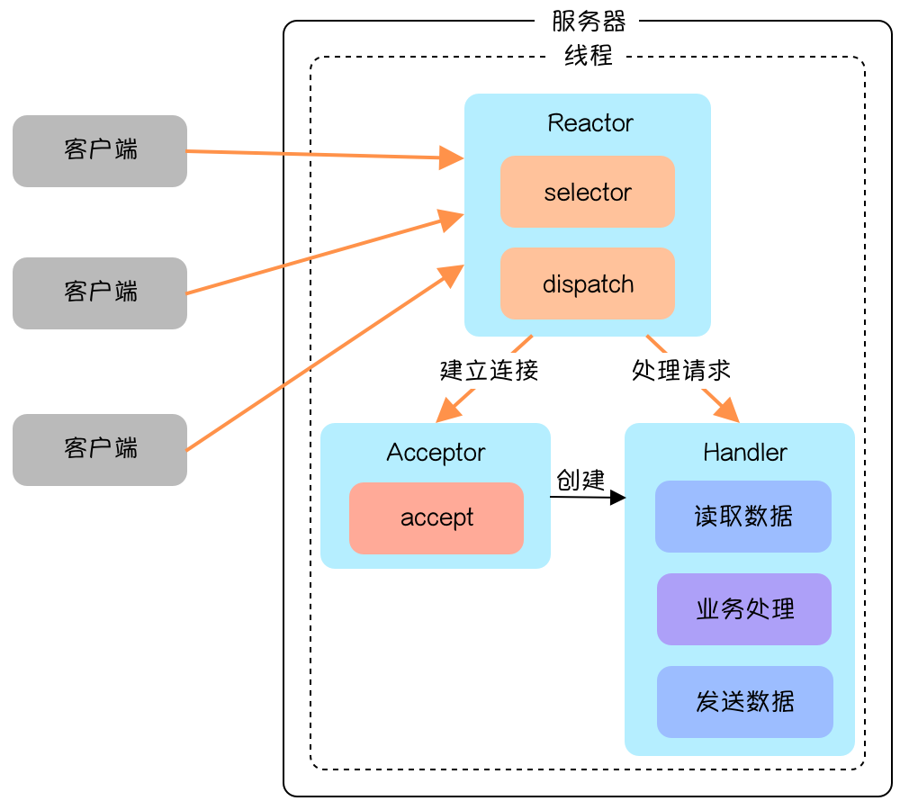
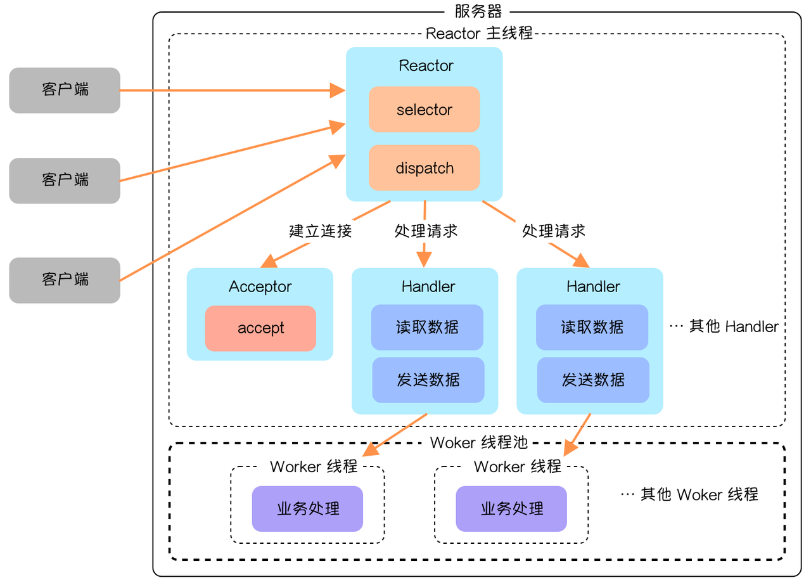
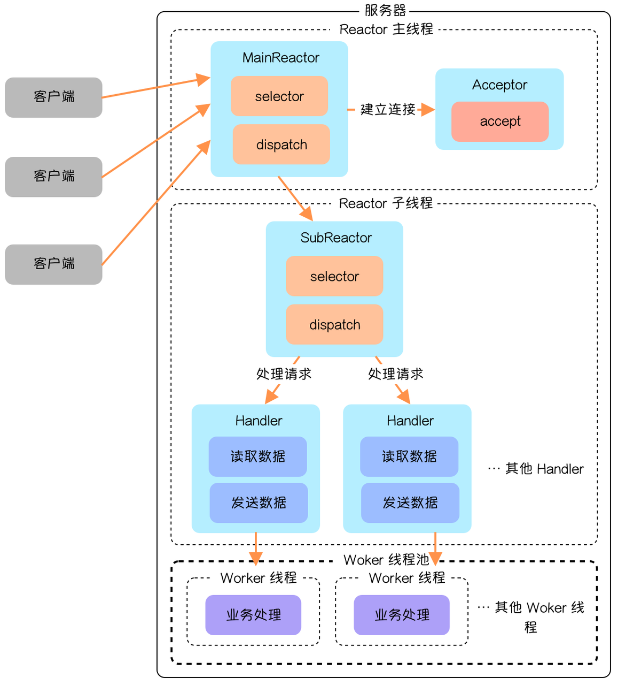
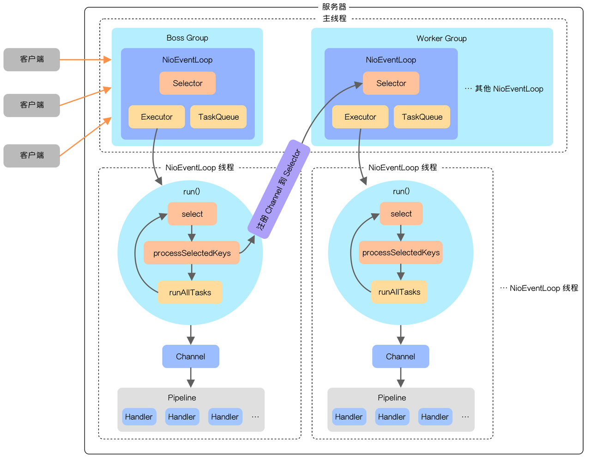

> Netty 的线程模型是基于 Reactor 模型改进而来的，因此需要先熟悉 Reactor 模型，帮助对于 Netty 线程模型的理解。

# **一. Reactor 模型**

## **1.为什么需要 Reactor 模型**

 传统阻塞 IO 模型具有设计上的不足之处：

- 每个连接都需要独立线程处理，当并发数大时，创建线程数多，占用资源
- 采用阻塞IO模型，连接建立后，若当前线程没有数据可读，线程会阻塞在读操作上，造成资源浪费

针对传统阻塞IO模型的两个问题，可以采用如下的方案：

- 基于池化思想，避免为每个连接创建线程，连接完成后将业务处理交给线程池处理
- 基于IO复用模型，多个连接共用同一个阻塞对象，不用等待所有的连接。遍历到有新数据可以处理时，操作系统会通知程序，线程跳出阻塞状态，进行业务逻辑处理

## **2.什么是 Reactor 模型**

The reactor design_pattern is an event_handling pattern for handling service requests delivered concurrently to a service handler by one or more inputs. The service handler then demultiplexes the incoming requests and dispatches them synchronously to the associated request handlers.

Reactor 设计模型是一种事件处理模式，用于处理通过一个或多个输入同时传递给服务处理程序的服务请求。然后，服务处理程序对传入的请求进行多路分解，并将它们同步分派给关联的请求处理程序。Reactor 模式也被称作 Dispatcher 模式。它的核心是 **多路复用器** ，多路复用器收到事件后会进行分发，这点是网络服务器高并发的关键。Reacotr 模型主要分为三个角色：

1.  **Reactor** ：把 IO 事件分配给对应的 handler 处理
2.  **Acceptor** ：处理客户端连接事件
3.  **Handler** ：处理非阻塞的任务

通过这三个角色的配合，实现了高并发的操作。而Reactor 模型分为三种：

1.  **单 Reactor 单线程**
2.  **单 Reactor 多线程**
3.  **多 Reactor 多线程**

这三种模型按顺序来看理解起来复杂度不断提升，也会更接近 Netty 的线程模型，下面来分别看看这三种模型。

### **(1). 单 Reactor 单线程**

这个最好理解，只有 **一个线程** ，只是会把 **建立连接** 和 **处理请求** 这两种任务分发给不同的类去处理，如下图所示：

  
    
  

整个流程简单来讲就是：

1. Reactor 通过 Selector 监听事件
2. 收到事件使用 dispatch 对事件进行分发
   + 如果是连接事件就由 Acceptor 进行处理，处理完成会创建一个 Handler 对后续业务进行处理。
   + 后面的数据请求都会由 Handler 进行处理

**优点**

- 模型简单，不会有多线程的那些问题

**缺点**

- 性能问题：单线程无法发挥多核 CPU 的性能
- 可靠性问题：处理业务时往往容易出问题，当 Handler 出问题了，由于只有一个线程，整个节点也挂了

### (2). 单 Reactor 多线程

这个线程模型针对前面的问题作出了一定的优化，多出了处理业务的线程池，如下图所示：

  
    
  

前面的流程与单 Reactor 单线程是一致的，到 Handler 这一步就不一样了：

- 这个模型 **Handler 只负责读取数据和发送数据部分，业务处理交给了 Worker 线程**，而 Worker 线程是由 Worker 线程池统一管理的。

**优点**

- 可以充分利用多核 CPU 的处理能力

**缺点**

- 多线程资源共享和访问处理会比较复杂，在主线程处理所有的连接、监听和响应也会出现性能瓶颈

### (3). 主从 Reactor 多线程

主从 Reactor 多线程模型又在前面的模型基础上做了进一步优化， **增加了子 Reactor** ，如下图所示：

  
    
  

**整个流程大概可以分为以下几步**：

- 主线程的 `MainReactor` 负责监听连接请求，收到连接请求会由 `Acceptor` 进行处理，成功建立连接之后 `MainReactor` 会把连接分派给 `SubReactor` ，由 `SubReactor` 监听和处理数据请求；
- `SubReactor` 监听到数据请求，会派发给 Handler 处理，Handler 只会处理读取数据和发送数据部分，中间业务处理部分也是放在线程池中完成。

**优点**

- `MainReactor` 与 `SubReactor` 职责分明，一个处理连接事件，一个处理数据请求；
- `MainReactor` 与 `SubReactor` 交互逻辑比较简单，`MainReactor` 单向地将建立好的连接传递出去；
- 多 Reactor 设计能在高并发场景拥有更好的性能。

**缺点**

- 编程复杂度较高

主从 Reactor 多线程模式是业界非常成熟的服务器程序设计模式，在很多中间件中都使用到了这种模式，像 Nginx、Memcached、Netty 等。这种模式也被称为 1 + M + N 模式，分别代指相对少的连接线程（不一定为 1 ），多个 I/O 线程和多个业务处理线程。

# 二. Netty 线程模型

Netty 线程模型是基于主从 Reactor 多线程模型优化而来的，整体架构如下图所示：

 
    
    
图4:Netty线程

Netty 的线程模型主要分为两部分，分别是 `BossGroup` 和 `WorkerGroup`，它们都分别管理一个或多个 `NioEventLoop`。每个 `NioEventLoop` 对应着一个线程，一个 `Selector`，一个 `Executor` 和一个 `TaskQueue`。`NioEventLoop` 可以理解成一个事件循环：

- 当程序启动后每个 `NioEventLoop` 都会通过 `Executor` 启动一个线程，开始执行事件循环。
- 在循环中 `Selector` 会通过 select 方法阻塞并监听就绪事件，当有事件到来时通过 `processSeelectedKeys` 方法处理 Selector 事件。
- 之后再通过 `runAllTasks` 方法处理其他的任务。

与前面介绍的 主从 Reactor 多线程模型类似：

- `BossGoup` 负责连接事件，当建立连接之后会生成一个 `NioSocketChannel` 并注册到 `WorkGroup` 其中一个 `NioEventLoop` 的 Selector 上。
- `WokerGroup` 中的 `NioEventLoop` 负责处理数据请求，当请求到来时会调用 `processSelectedKeys` 方法，其中的业务处理会依次经过 Pipeline 中的多个 Handler。
